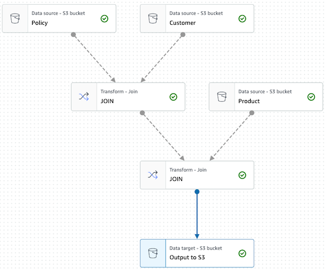

# Data Migration

Usecase: Company is planning on migrating production data from legacy system to new cloud based solution. Goal is to simulate this migration with randomly generated test data to assess various migration strategies.

## Step 1. Generate Test Data

Data resides in 3 database tables:
* Customer
* InsuranceProduct
* InsurancePolicy

```json
Sample-Customer = {
  CustomerID: 'cust-01353741',
  Prefix: 'Mrs.',
  FirstName: 'Jan Jaap',
  LastName: 'de Vos',
  Address: '1097 Upra Place',
  City: 'Roppeja',
  Zip: '9477AZ',
  Country: 'NL',
  Phone: '+31699828357',
  Email: 'posopu@fotju.hr',
  DateOfBirth: '6/17/1973',
  Gender: 'Male',
  Username: 'Shark6879'
}

Sample-InsuranceProduct = {
  ProductID: 'prod-92d6aa1e',
  ProductName: 'NON-LIFE - autoverzekering / car'
}

Sample-InsurancePolicy = {
  PolicyID: 'plcy-e9aae009',
  CustomerID: 'cust-e5c201a8',
  ProductID: 'prod-bff0437c'
}
```

Generate test data
```bash
$ cd ./01-Generate-Test-Data
$ node GenerateSampleData.ts
$ cd CSV
$ ls
InsuranceCustomer.csv InsurancePolicy.csv   InsuranceProduct.csv
```

## Step 2. Deploy Data Components as Code

Data ingested from legacy system is stored as Comma Seperated Value (CSV) file in S3 Bucket. Then a Glue Crawler detects the various database attributes of those 3 database tables.

1. Create S3 bucket
2. Upload CSV Test Data
3. Create Glue Crawler incl Classifiers
4. Run Glue Crawler On-Demand (manual step)

Deploy data components
```bash
$ cd ../../02-AWS-Data-Infra
$ cdk synth
$ cdk deploy
```

## Step 3. Denormalize data

Denormalizing your data or joining various sources combines rows from 2 or more tables. In this usecase we need to join data from 3 tables.

Tools considered for denormalization
- Glue Data Studio
- Athena

### Glue Data Studio

Glue Data Studio delivers a visual workflow editor that support [data transformations](https://docs.aws.amazon.com/glue/latest/ug/edit-jobs-transforms.html) such as JOIN.



Advantages
- Based on Spark this option supports large tables.
- Number of worker can be limited to 2 for small workloads.

Disadvantages
- Visual workflow editor supports joining 2 sources into one output as single step. Joining 3 tables requires multiple steps.
- The output consists of many files, depending on number of workers (tested 10 workers => 36 files, 2 workers => 4 files).

### Athena

Athena offers a serverless, distributed SQL engine based on Presto Open Source that supports SQL queries.

Advantages
- SQL based
- single step 3-way JOIN

```SQL
SELECT *
FROM "insurance_database"."policy"
JOIN "insurance_database"."customer" 
ON policy.customerid=customer.customerid
JOIN "insurance_database"."product" 
ON policy.productid=product.productid;
```

## Step 4. Selection / Filtering

Selecting a subset a data is required to create data partitions based on attributes. Usecase here is to select customers from specific countries. Evaluation of S3 Select, Athena and Glue.

### Athena

Advantages
- Supports complex SQL
  - including JOIN
  - including DISTINCT, can be used for deduplication
- Query multiple files/partitions at once

```SQL
SELECT DISTINCT *
FROM "insurance_database"."policy"
JOIN "insurance_database"."customer" 
ON policy.customerid=customer.customerid
JOIN "insurance_database"."product" 
ON policy.productid=product.productid;
```

### S3 Select

Advantages
- Cost effective

Disadvantage
- only basic SQL support
  - no JOIN
  - no DISTINCT
- only queries single S3 object at a time

```SQL
SELECT * FROM s3object s where s.country = 'NL'
```

Next step - store results in S3 + Catalog.
